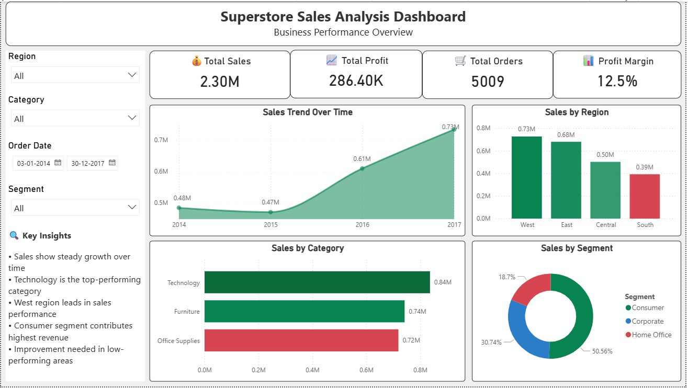
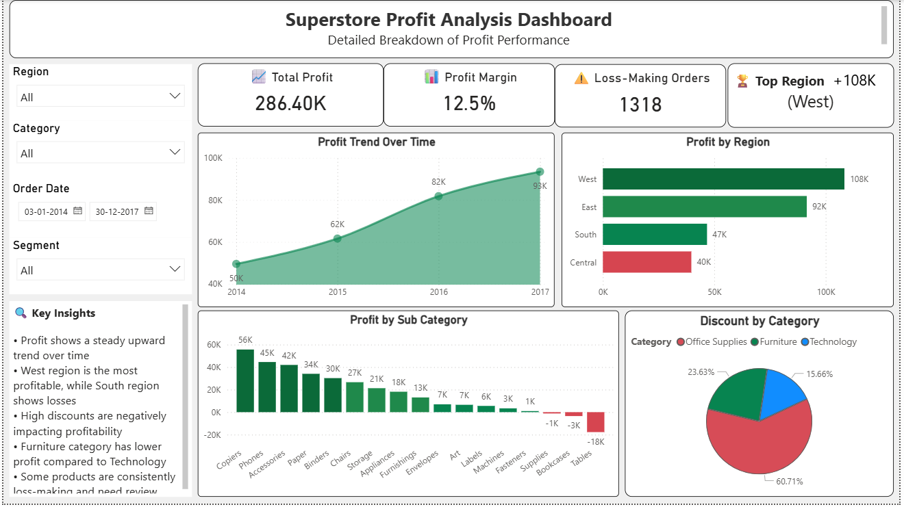
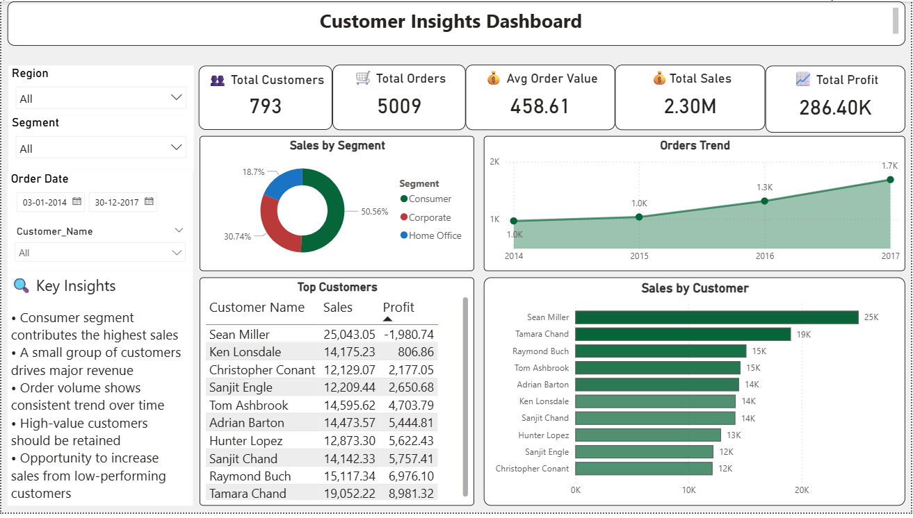

# 📈 Superstore Sales & Profit Analysis

## 🎯 Objective
To analyze sales, profit, and discount data to identify business trends and improve decision-making using data analytics techniques.

---

## 🛠 Tools & Technologies
- Python (Pandas, NumPy)
- SQL (Data Extraction & Analysis)
- Power BI
- Microsoft Excel

---

## 📌 Project Workflow
- Data collection and cleaning  
- Data extraction using SQL queries  
- Exploratory Data Analysis (EDA)  
- Sales, profit, and discount trend analysis  
- KPI dashboard creation using Power BI  

---

## 📈 Key Insights
- Certain regions generate high sales but low profit  
- Discounts significantly reduce overall profit margins  
- Some product categories perform better in terms of profitability  
- Seasonal patterns impact sales performance  

---

## 📊 Dashboard Preview

